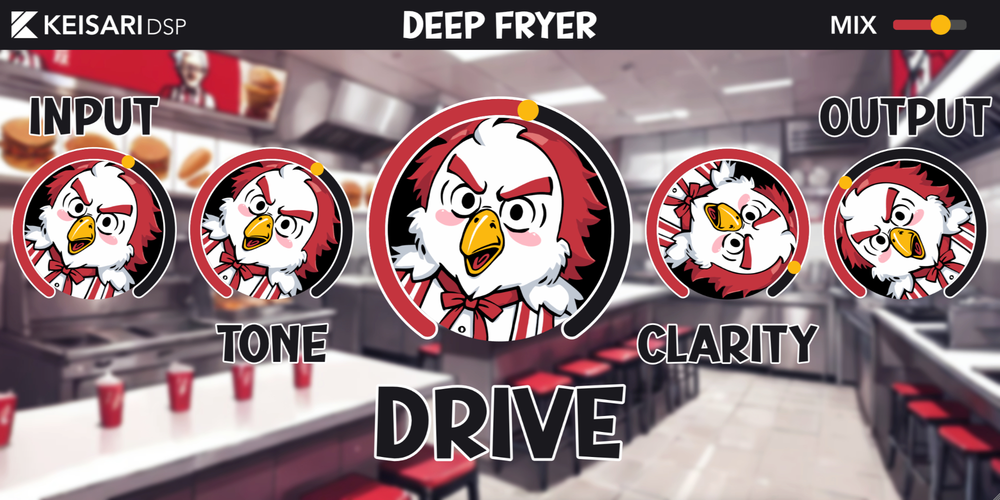

# Deep Fryer
A dynamic distortion effect plugin meticulously crafted to emulate the iconic Neve 1073 Preamplifier. Immerse your sound in the vintage essence of Fried Chicken.
 
Deep Fryer is compatible with both Windows and MacOS (Intel/Apple Silicon). Available as a VST3 and AU plugin.

## User Interface

## Download
To download the latest release, visit the [official website](https://eemilahonen.github.io/plugins/deep-fryer).

[//]: # (## Changelog)
[//]: # (#### Version 1.0.0)
[//]: # (- Release)

## Credits
- Lead Developer & Graphics - [Keisari](https://github.com/EemilAhonen)
- Help with the Windows Build - [Konemui](https://github.com/Konemui-dev)

## Special Thanks
I express my gratitude to anyone who provided support, feedback, or additional contributions, even if they didn't directly work on the codebase.

## License
The source code is licensed under the GPLv3. For more details, please see the [license documentation](LICENSE).